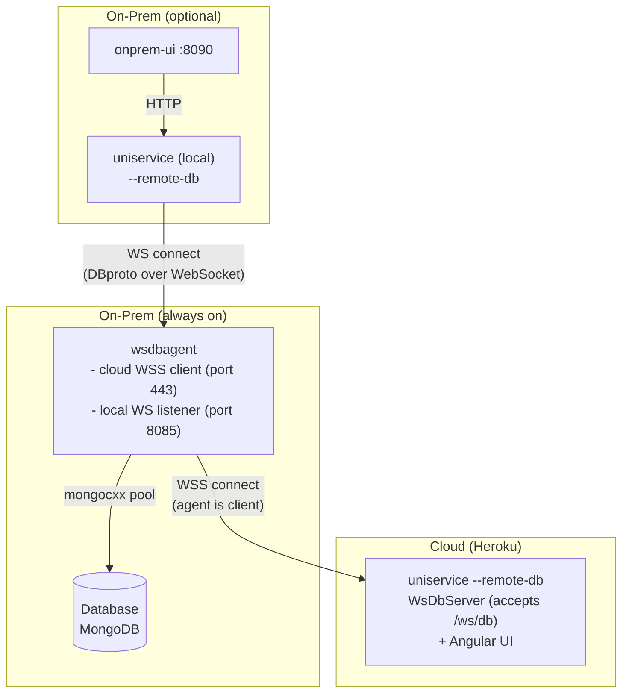

# Design: Local WebSocket Agent Proxy

## Problem

Today the on-prem deployment has two disjoint stacks:

- **Cloud (Heroku):** uniservice `--remote-db` → wsdbagent via WSS → MongoDB
- **Local:** uniservice in direct-DB mode (`mongocxx::pool` → MongoDB)

The local stack needs its own MongoDB. The onprem UI can't reach the same MongoDB
without a completely separate data path.

## Goal

A single **wsdbagent + MongoDB** pair that serves both cloud and local backends
simultaneously. wsdbagent listens on a **local WebSocket port** (plain WS, port 8085)
alongside its existing cloud WSS connection. The local uniservice connects with
`--remote-db ws://wsdbagent:8085/ws/db` — the existing `WsDbServer` + `WsMongodbProxy`
path already in production on Heroku.

No new protocol, no new client class, no new framing. Just a second listener on
wsdbagent.

---

## Architecture



Both sessions — cloud WSS and local WS — run concurrently in wsdbagent. Both call
the same `dispatch()` → `MongodbClient` backed by `mongocxx::pool`.

---

## Changes

### wsdbagent

**New CLI flag:**

```
--local-ws-port <port>    Port for local WS listener (default: 8085)
                          0 = disabled.
```

**New class: `LocalWsListener`** — self-contained accept + session loop that reuses the
existing `dispatch()` logic from `WsDbAgent::dispatch()` (wsdbagent.cpp:276):

```
LocalWsListener:
  - Owns ACE_SOCK_Acceptor on --local-ws-port
  - accept() → WebSocket upgrade (server-side) → run_session()
  - run_session() reads WS binary frames, parses DbRequest, calls dispatch(),
    sends DbResponse back — identical logic to WsDbAgent::run_session()
  - Runs in its own std::thread
```

`WsDbAgent` gains a `LocalWsListener` member. Both the cloud WSS `run_session()`
and the local listener thread share the same `MongodbClient`.

```
                    ┌──────────────────┐
  cloud WSS ───────►│                  │
                    │  wsdbagent       │
  local WS  ───────►│                  │
  (port 8085)       │  ┌────────────┐  │
                    │  │ dispatch() │──┼──► MongodbClient ──► mongod
                    │  └────────────┘  │
                    └──────────────────┘
```

### uniservice

No code changes. Started with: `--remote-db ws://wsdbagent:8085/ws/db`

### docker-compose.onprem.yml

```yaml
services:
  mongodb:
    # unchanged

  wsdbagent:                          # ← new service
    build:
      context: .
      dockerfile: docker/Dockerfile.wsdbagent
    image: wsdbagent:latest
    container_name: xpmile-wsdbagent
    restart: unless-stopped
    depends_on:
      mongodb:
        condition: service_healthy
    environment:
      ARGS: >-
        --server-host ${SERVER_HOST:-marvel-3a78bd953f5f.herokuapp.com}
        --mongo-db-uri mongodb://${MONGO_APP_USER:-xpmile}:${MONGO_APP_PASS:-xpmile_pass}@mongodb:27017/${MONGO_DB:-xpmile}?authSource=admin
        --mongo-db-name ${MONGO_DB:-xpmile}
        --local-ws-port 8085
    networks:
      - xpmile-net

  app:
    build:
      context: .
      dockerfile: docker/Dockerfile.local
    image: xpmile-local:latest
    container_name: xpmile-app
    restart: unless-stopped
    depends_on:
      - wsdbagent
    environment:
      PORT: "8080"
      ARGS: >-
        --server-worker 5
        --mongo-db-name ${MONGO_DB:-xpmile}
        --remote-db ws://wsdbagent:8085/ws/db
    ports:
      - "${HOST_PORT:-8080}:8080"
    networks:
      - xpmile-net

  onprem-ui:
    # unchanged

volumes:
  mongo-data:
```

### Dockerfile.local

Same `cpp-builder` stage as `docker/Dockerfile`. Runtime copies only `uniservice`
(no Angular `webui/`). Skips `ui-builder` stage.

---

## Sequence diagram — local request

```
MicroService worker    WsMongodbProxy    WsDbServer    wsdbagent (local WS)   MongodbClient
      │                    │                │                │                    │
      │ get_document(...)  │                │                │                    │
      │───────────────────►│                │                │                    │
      │                    │ build_request()│                │                    │
      │                    │ dispatch() ───►│                │                    │
      │                    │                │ ws_send(frame) │                    │
      │                    │                │───────────────►│                    │
      │                    │ (blocks on cv) │                │ dispatch() ───────►│
      │                    │                │                │                    │
      │                    │                │◄───────────────│◄─── JSON ─────────│
      │                    │                │ ws_recv_frame()│                    │
      │                    │◄─ notify cv ───│                │                    │
      │◄── result ────────│                │                │                    │
```

---

## Concurrent safety

- `LocalWsListener` calls `dispatch()` on the same `MongodbClient` instance the cloud
  session uses — backed by `mongocxx::pool` (thread-safe). No additional locking needed.
- Responses are written back on the same WebSocket the request arrived on — no routing
  ambiguity between cloud and local clients.
