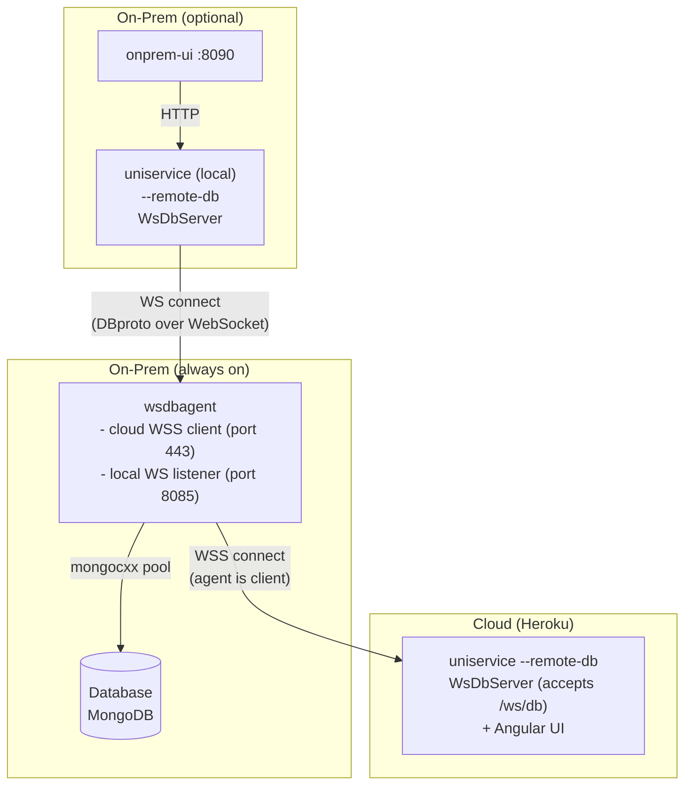

# Design: Local WebSocket Agent Proxy

## Problem

Today the on-prem deployment has two disjoint stacks:

- **Cloud (Heroku):** uniservice `--remote-db` → wsdbagent via WSS → MongoDB
- **Local:** uniservice in direct-DB mode (`mongocxx::pool` → MongoDB)

This means the local stack needs its own MongoDB, and switching between cloud and local
requires running two separate backends — nothing is shared. The onprem UI is supposed to
be a drop-in replacement when Heroku is unreachable, but it can't reach the same MongoDB
without a completely separate data path.

## Goal

A single **wsdbagent + MongoDB** pair that serves both cloud and local backends
simultaneously. wsdbagent listens on a **local WebSocket port** (plain WS, port 8085)
alongside its existing cloud WSS connection. The local uniservice connects with
`--remote-db ws://wsdbagent:8085/ws/db` — the same `WsDbServer` + `WsMongodbProxy`
code path already in production on Heroku.

No new protocol, no new client class, no new framing. Just a second listener on
wsdbagent.

---

## Architecture



**Connection directions:**
- wsdbagent **connects outbound** to cloud uniservice (WSS client → server)
- Local uniservice **connects** to wsdbagent via WS (WsDbServer → wsdbagent local listener)
- onprem-ui **connects** to local uniservice via HTTP (browser → backend)

**Three blocks:**
1. **Cloud (Heroku)** — uniservice + Angular UI, WsDbServer accepts agent's WSS
2. **On-Prem — always on** — wsdbagent + MongoDB, the persistent data tier; WSS client to cloud,
   local WS listener for on-prem
3. **On-Prem — optional** — onprem-ui + local uniservice; started on-demand when cloud is
   unreachable; connects via WebSocket to the always-on agent

**Key properties:**

1. wsdbagent keeps its cloud WSS connection AND accepts local WS connections simultaneously
2. The local uniservice uses the existing `--remote-db` flag with `ws://wsdbagent:8085/ws/db`
3. No new code in uniservice — same `WsDbServer` + `WsMongodbProxy` path
4. Both cloud and local sessions call the same `dispatch()` → `MongodbClient`
5. onprem-ui is unchanged — it still hits `http://localhost:8080`

---

## wsdbagent changes

### New CLI flag

```
--local-ws-port <port>    Port for local WebSocket listener (default: 8085)
                          When 0 or absent, the local listener is disabled.
```

### Internal changes

`WsDbAgent` gains a local `WsDbServer` instance — the exact same acceptor used in
Heroku uniservice (`modules/module/wsdbproxy/inc/wsdbproxy.hpp`), reused verbatim:

```
WsDbAgent gains:
  - m_localServer:     WsDbServer              (accepts local WS connections)
  - m_localServerThr:  std::thread             (runs the local server)
```

`WsDbServer` is already an `ACE_Task`. Its `svc()` accepts, upgrades to WebSocket,
and runs the `run_session()` loop — reading frames, dispatching to `IWsDispatcher`,
and writing responses. The only difference: `WsDbServer` normally calls
`IWsDispatcher::dispatch()` on a `WsMongodbProxy`, but here we provide an adapter
that delegates directly to `MongodbClient`.

### Adapter: `LocalDbDispatcher`

A thin `IWsDispatcher` implementation that maps DBproto requests to local `MongodbClient`
calls — same logic as `WsDbAgent::dispatch()` today, extracted to satisfy the
`IWsDispatcher` interface:

```
                    ┌──────────────────┐
  cloud WSS ───────►│                  │
                    │  wsdbagent       │
  local WS  ───────►│                  │
  (port 8085)       │  ┌────────────┐  │
                    │  │ dispatch() │──┼──► MongodbClient ──► mongod
                    │  └────────────┘  │
                    └──────────────────┘
```

The existing cloud `run_session()` loop and the `WsDbServer::svc()` thread run
concurrently in separate threads. Both converge on the same `dispatch()` which
maps `DbOp` to `MongodbClient` calls.

### Reuse from WsDbServer

`WsDbServer` at `wsdbproxy.cpp:94-145` already handles:
- `ACE_SOCK_Acceptor::accept()` for incoming connections
- WebSocket upgrade handshake
- `run_session()` loop — `ws_recv_frame()` → dispatch → `ws_send()` response
- Ping/pong keepalive (30s interval)
- `fail_all_pending()` on disconnect

The local WS path is plain TCP (no TLS) since it's container-internal on the bridge
network. `WsDbServer` supports both plain and TLS modes via its `m_tls_mode` flag.

---

## uniservice changes

### Startup — no code changes

The local uniservice is started with the existing `--remote-db` flag pointing at
wsdbagent's local port:

```
uniservice --remote-db ws://wsdbagent:8085/ws/db ...
```

This triggers the existing startup path in `webservice_main.cpp`:

```cpp
if (!opt[idx(Arg::REMOTE_DB)].empty()) {
  auto wsServer = std::make_unique<WsDbServer>(...);
  auto db = std::make_unique<WsMongodbProxy>(*wsServer);
  inst = WebServer(ip, port, workers, std::move(db), std::move(wsServer));
}
```

Zero code changes in uniservice. The `WsMongodbProxy → WsDbServer → WebSocket → wsdbagent`
path is already used in production on Heroku.

### No changes

| Component | Reason |
|-----------|--------|
| `AgentLocal` | Not created — not needed |
| `WebConnection` / `WebServer` | Same code path as Heroku |
| `WsMongodbProxy` | Reused as-is |
| `WsDbServer` | Reused as-is — becomes dual-use (Heroku acceptor + local connector) |
| `dbproto.cpp` | Reused as-is |
| `MicroService` / all handlers | Unaware of transport |
| `onprem-ui` (Java) | Still hits `http://app:8080` |
| `webservice_main.cpp` | No new flags, no new startup paths |

---

## Docker compose changes

### `docker-compose.onprem.yml`

Adds `wsdbagent` as a service:

```yaml
services:
  mongodb:
    # unchanged — same image, same config

  wsdbagent:
    build:
      context: .
      dockerfile: docker/Dockerfile.wsdbagent
    image: wsdbagent:latest
    container_name: xpmile-wsdbagent
    restart: unless-stopped
    depends_on:
      mongodb:
        condition: service_healthy
    environment:
      ARGS: >-
        --server-host ${SERVER_HOST:-marvel-3a78bd953f5f.herokuapp.com}
        --mongo-db-uri mongodb://${MONGO_APP_USER:-xpmile}:${MONGO_APP_PASS:-xpmile_pass}@mongodb:27017/${MONGO_DB:-xpmile}?authSource=admin
        --mongo-db-name ${MONGO_DB:-xpmile}
        --local-ws-port 8085
    networks:
      - xpmile-net

  app:
    build:
      context: .
      dockerfile: docker/Dockerfile.local
    image: xpmile-local:latest
    container_name: xpmile-app
    restart: unless-stopped
    depends_on:
      - wsdbagent
    environment:
      PORT: "8080"
      ARGS: >-
        --server-worker 5
        --mongo-db-name ${MONGO_DB:-xpmile}
        --remote-db ws://wsdbagent:8085/ws/db
    ports:
      - "${HOST_PORT:-8080}:8080"
    networks:
      - xpmile-net

  onprem-ui:
    # unchanged

volumes:
  mongo-data:
```

No Unix socket volume needed. `app` connects to `wsdbagent:8085` over the bridge
network via WebSocket — same transport as Heroku, just local.

### `Dockerfile.local`

Same `cpp-builder` stage as `docker/Dockerfile`, but the runtime stage copies only
`uniservice` (no Angular `webui/`). Skips the `ui-builder` stage entirely.

---

## Sequence diagram — local request

```
MicroService worker    WsMongodbProxy    WsDbServer    wsdbagent (local WS)   MongodbClient
      │                    │                │                │                    │
      │ get_document(...)  │                │                │                    │
      │───────────────────►│                │                │                    │
      │                    │ build_request()│                │                    │
      │                    │ dispatch() ───►│                │                    │
      │                    │                │ ws_send(frame) │                    │
      │                    │                │───────────────►│                    │
      │                    │ (blocks on cv) │                │ dispatch() ───────►│
      │                    │                │                │                    │
      │                    │                │◄───────────────│◄─── JSON ─────────│
      │                    │                │ ws_recv_frame()│                    │
      │                    │◄─ notify cv ───│                │                    │
      │◄── result ────────│                │                │                    │
```

---

## Concurrent safety

- `WsMongodbProxy::dispatch()` blocks on a condition variable — one per in-flight request.
  MicroService workers serialize on the WebSocket write mutex in `WsDbServer::ws_send()`.
- wsdbagent's `dispatch()` operates on a single `MongodbClient` instance backed by
  `mongocxx::pool` (thread-safe). Both cloud and local sessions share it.
- Responses are written back on the same WebSocket the request arrived on — no routing
  ambiguity.
